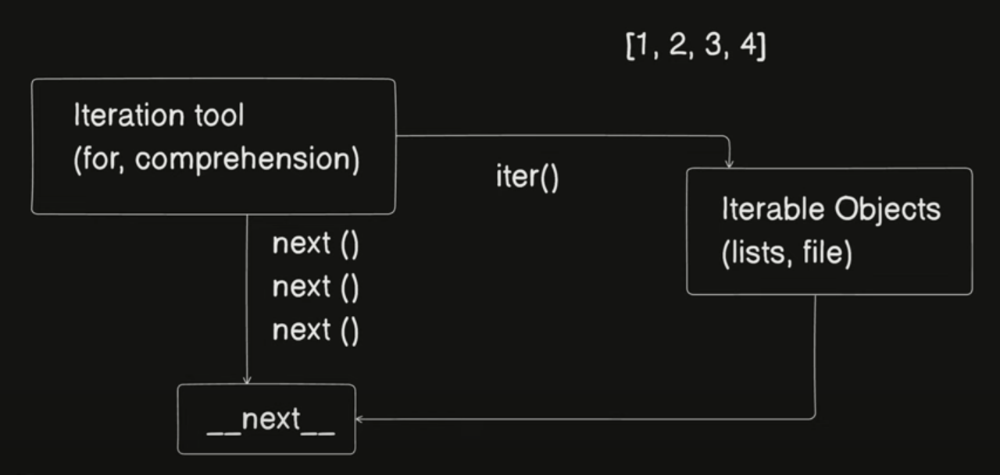
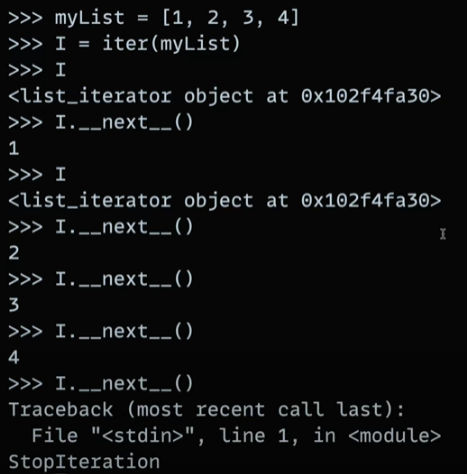

## INTRO

- Python is an interpreted language.
- .py (python file) --> .pyc( byte code) --> python virtual machine.
  - .pyc = compiled python ( frozen binaries )
  - python file first converted into byte code is low level code which makes it platform independant.

\***\*pycache**FOLDER\*\*

- pycache folder is created when we import files
- it contains .pyc file (xyz.cpython-pytonVersion.pyc)
  source change python version

**PVM (python virtual Machine)**

- Run time engine.
- also known as python interpreter.

**Byte Code**

- It is python specific interpretation.
- It is not machine code.

{} = type of dictionary
so empty set is represented by set().

## STRINGS

- Stringsare immutable.
- `string_slice [ startIDX : Not included end idx : hopping ]`
- In slicing last index is not included.
- In hopping it will skip ( hopping - 1 ) characters.
- `str.STRIP() - it will remove spaces from front and back of string by default. But if we pass something in function it will strip those e.g. if we pass ", " now it will strip ,Space in string.`
- `str.replace ( 'what to search', ' what to replace with' )`
- `str.find("what to find") // return index or return -1 if not found.`
- `str.count ( "what to count" )`
- {} - placeholders are used in string and we can replace these placeholders by passing in format method of string.
  e.g.

```
name = "xyz"
str = "My name is {}"
print(str)  //output -> My name is {}

print(str.format(name))  // output -> My name is xyz
```

- converting list to string

```
name = ["A","B","C"]
print("".join(name)) // 'ABC'
print(",".join(name)) // 'A,B,C'
```

-` len( string ) ->return length of string including space.`

- **Unicode escaping**
  - In strings if we can use unicode escape expressions
  ```
   print ("He said, "My name is Xyz"") // It will give syntax error
   print ("He said, \"My name is Xyz\"") // output -> He said, "My name is Xyz.
   print r("He said, "My name is Xyz"")
  ```

## List

- List is mutable.
- `list.append (" what to add ") // add in last of list`
- `list.insert (index,"what to add") // add at specified index of list`
- `list.remove ("what to remove") `
- `list[1:1] = [1,2] // add 1 and 2 at 1 `
- `list[1:1] = [] // delete index 1 `
- `list_copy = list1.copy() //copying list`
- list compreshension - we can do calculation inside list
  - ` list = [x**2 for x in range(10)] //insert square from 0 to 9 in list`

## Dictionaries

- DIctionary is a key value pair.
- It is mutable.

```
dictionary = {"key1":"value1","key2":"value2"}

for x in dict:
    print(x) // gives keys

for x in dict.keys():
    print(x) // gives keys

for x in dict.values():
    print(x) // gives values

for key,value in dict.items():
    print(key,value) // to iterate key values simultaneously

```

- In dictionary we have to pass key in pop it will not remove last item.
- popitem() method in dictionary works as pop works normally.
- ` dict.pop("key") => return value and remove key value pair for matching key`

## Tuple

- Tuples are **immutable.**

```
tuple = (1,2,3)   //{k:v}-> dictionary, [] -> list

(one,two,three) = tuple // Now variable one = 1, two =2 and three = 3.

```

## Loop Internal Working



1. Iteration tool send iter() to iterable Objects.
2. Iterable object returns '**next **' it contains starting address of iiterable object.
3. Then we call next( ) for every item.
4. When item end an exception is returned which stops the loop.

## Opening and Reading Files

```
f = open("file path in strings ")
f.readline() // gives 1st line of file
f.readline() // gives 2nd line of file
        .
        .
        .
        .
// returns ''(empty string) when file is completely read.
```

```
f = open("file path")
f.__next__() //gives lines from file
f.__next__() //gives lines from file
    // throw StopIteration Exception when file finished
```

**next() in list**


- iter(iterable object) returns the address of first element.
- If we use I.\__next**\() where "I" is starting address returned by iter(). "I" will store the starting address even after using **next_\_().

```
f = open('file')
iter(f) is f //True
// here variable used for file beome iterable object.

mylist = [1,2,3]
iter(mylist) is mylist //False

// whereas mylist is the reference of actual object
```

## Functions

- Lambda functions -Anonymous functions which will be used only once.
- A lambda function can take any number of arguments, but can only have one expression.

```
x = lambda parameter1,parameter2 : return parameter1 + parameter2
print(x(1,2))
```

- **Function with Variable args**

```
def sum(*args):
    sum = 0
    for x in args:   // Here args is tuple so we can iterate it.
        sum+=args
    return sum
```

- \*args is a tuple and \*\*kwargs is dict.

- **Accepting Variable number of key value**

```
def varkwArgs( **kwargs ):
    for key,val in kwargs.items(): // kwargs is a dict type.
        print("key",key,"val",val)

varkwArgs(Name = "ABC", Class = "6th")
varkwArgs(Name = "XYZ")
```

- \*\*kwargs is a dictionary.
- **yield vs. return**

```
 def evenGenerator(limit):
      for x in range(2,limit+1,2):
          yield x

// Now evenGenerator is a type generator which is iterable
 for x in evenGenerator(10):
      print(x)
```

- yield is used instead of return to create generator.
- yield does not end the program after giving value instead it stores the iteration to continue after giving the value out of function.
- return ends the function instantly.<br><br>

## Scopes and closures

- **global** keyword can be used to declare global variable anywhere in program scope.
- When we try to use a variable in a function  
  `check if available locally -> parent function -> Globally`
- **closure** bundles a functioni defination along with associated variables.

```
def func1(num):
   def func2():
       print(num)
return func2

var = func1(3)  // var holds both func2 defination and associated variable(num)
```

## Oops in python

```
class Car:
    def __init__(self,brand,model):
        self.brand = brand
        self.model = model

# self is similar to this keyword
# __init__() is the constructor we have to use in python

my_car = Car("Hero","Honda")
print(my_car.brand,my_car.model)
```

- `__init __(self,params)` is constructor for classes in python and `self` is used as `this` keyword is used in js and cpp.

**Inheritance**

```
# Inheriting class Car in ElectricCar
# ElectricCar have access to all of the method, constructor,attributes.

class ElectricCar( Car ):
    def __init__(self,brand,model,batteryCapacity):
        self.batteryCapacity = batteryCapacity

# using parent class constructor to initialize other attributes
        super().__init__(brand,model)
```

- We can inherit a class by passing it in Parenthesis to other class.
- To make an attribute `private` start it's name with "**" e.g. ```**brand``` now \_\_brand is a private attribute.
- Private attributes cannot be accessed outside class not even in it's own object we have to use getter and setter for that.

**Static Method**

- Static Methods are only accessible for class only they cannot be accessed by object.
- In static method we don't have to pass `self`.

```
@staticmethod
def statMethod():
    print("This is a static method")

# accessing static method

className.staticMethodName()
```

**propety decorator**

- By using property decorator we don't have to call a method it becomes a property which will give whaatever we return from method.
- we can use it to make a attribute read only.

```
@property
def model(self):
    return self.__model

# getting model by using property method

myCar.method # we don't have to use parenthesis as model is a property
```

## Decorators

- Decorators are like checkpoints from which every function in which it is used have to go through.
- Decorators allow us to wrap another function in order to extend the behaviour of the wrapped function, without permanently modifying it.

```
# defining decorator
def whoRU (func):
    def wrapper(*args, **kwargs):
        print(f"Hello {func.__name__} arguments are {args}")
        return func(*args)

    return wrapper

#Using decorator

@whoRU
def sum(*args):
    sum = 0
    for x in args:
        sum += x
    return sum

print(sum(1,2,3))

# output
Hello sum arguments are (1,2,3)
6
```
